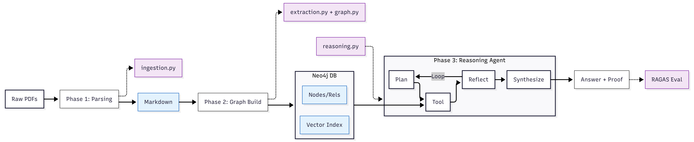

# 🧬 MedGraph-RAG

### **Hybrid Retrieval & Chain-of-Graph Reasoning System**

[](https://medium.com/@himath.nimpura/i-built-a-medical-knowledge-graph-because-vector-rag-is-dumb-sometimes-02e26e36c3dc)

A sophisticated medical research assistant that bridges the gap between semantic search and structured knowledge reasoning. By combining **Neo4j knowledge graphs** with **Google Gemini**, MedGraph-RAG traverses complex medical relationships to answer multi-hop questions that confuse traditional vector-only systems.

---

## 🏗️ Architecture



### **Core Capabilities**

*   **🕸️ Hybrid Retrieval**: Merges vector similarity search (unstructured text) with graph traversal (structured relationships).
*   **🧠 Chain-of-Graph Reasoning**: Uses **LangGraph** to "walk" the knowledge graph, discovering hidden connections between symptoms, diseases, and treatments.
*   **✅ Self-Correcting**: Integrated **RAGAS** evaluation detects hallucinations and insufficient evidence in real-time.
*   **🩺 Medical Precision**: Built on PubMed research papers, mapped to MeSH (Medical Subject Headings) terms.

---

## 🚀 Getting Started

### **Deployment (DigitalOcean / Docker)**

Deploy easily using the included Docker configuration.

```bash
# 1. Clone the repository
git clone https://github.com/HimathX/MedGraph-RAG.git
cd MedGraph-RAG

# 2. Add your API Key
# Create a .env file with: GOOGLE_API_KEY, NEO4J_URI, NEO4J_USERNAME, NEO4J_PASSWORD

# 3. Launch
docker compose up -d --build
```

Access the app at `http://localhost:8501`.

---

### **Tech Stack**

*   **Reasoning**: LangGraph, LangChain
*   **Knowledge Graph**: Neo4j AuraDB (Graph + Vector Index)
*   **LLM**: Google Gemini 2.0 Flash
*   **Evaluation**: RAGAS
*   **Interface**: Streamlit

<br>

<div align="center">
  <p>Built with ❤️ by Himath Nimpura</p>
</div>
